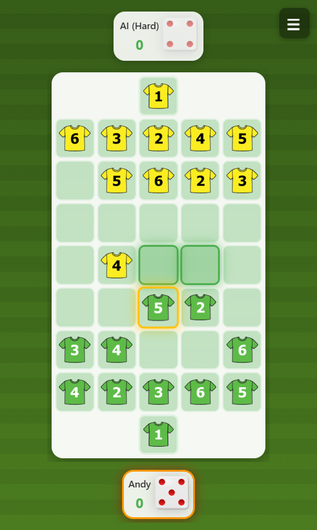
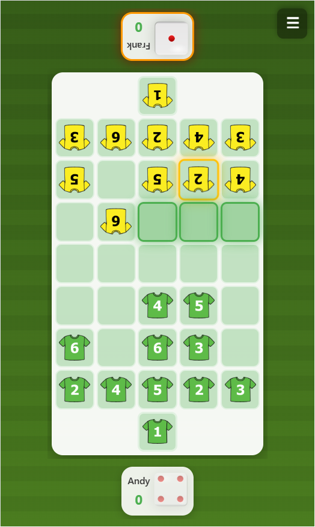
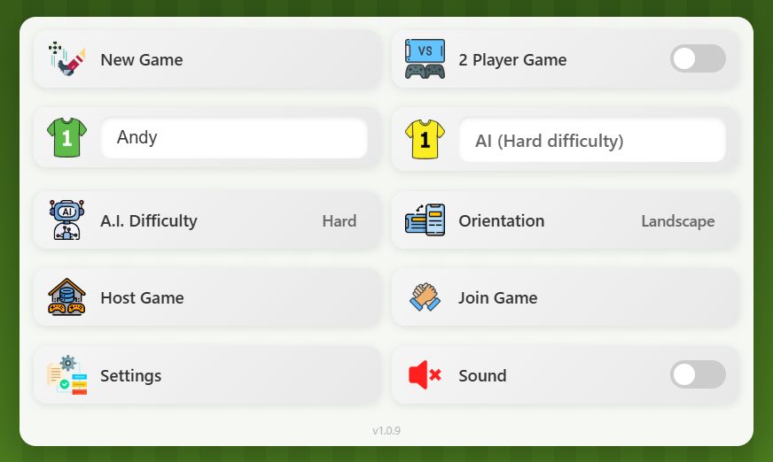

# Dice Soccer Game

A digital adaptation of the classic board game **Torjäger** by [Kosmos](https://www.kosmos.de/de/torjager-2507) (Germany), bringing strategic dice-based soccer gameplay to web browsers and mobile devices.

## 📸 Screenshots

  
  
  

  
  

## 🎮 About the Game

This game is a web-based recreation of Torjäger, a beloved board game that combines dice rolling with tactical soccer gameplay. Originally designed by Kosmos in Germany, this digital version allows players to enjoy the same strategic gameplay on any device - whether it's a desktop computer, tablet, or smartphone.

The inspiration for this project came from countless hours playing the physical board game at home with family. Now, the game can be enjoyed anywhere, with special features like a unique portrait mode where two players can sit opposite each other sharing a single phone, with each player's view properly oriented for comfortable play.

## 🛠️ Technology Stack

- **Frontend**: HTML5, CSS3, Vanilla JavaScript
- **Backend**: PHP (for multiplayer functionality)
- **Storage**: JSON file-based storage for multiplayer game state
- **Audio**: Web Audio API for sound effects
- **Graphics**: CSS animations and transforms
- **Progressive Web App**: Service Worker for offline capability and installability
- **Architecture**: Long-polling for real-time multiplayer communication

## 📋 Game Rules

### Objective
Be the first player to score **3 goals** by moving your soccer players across the field and into your opponent's goal.

### Gameplay Mechanics

1. **Dice Rolling**: Players take turns rolling a six-sided dice to determine which player piece they can move.

2. **Player Selection**: 
   - If you roll a number matching one of your player's shirt numbers (2-6), you must move that player if possible
   - Each team has two players of each number (2, 3, 4, 5, 6) and one goalkeeper (1)
   - If no player with the rolled number can move, you may move any player that has a valid move available

3. **Movement Rules**:
   - Players can move forward (toward opponent's goal) or diagonally forward
   - Players can move only one space per turn
   - Players cannot move backward or sideways
   - Players cannot occupy the same space
   - Empty cells in the corners (first and last columns, except goal) cannot be entered

4. **Scoring**:
   - **Goal Scoring**: A goal is scored when a player piece reaches the opponent's goal cell (middle cell of the first/last column)
   - **Blocking Victory**: A player also scores if their opponent has no valid moves available (all opponent pieces are blocked)
   - After scoring (by either method), the round resets with all players returning to their starting positions
   - The player who lost the previous round starts the next round
   - First player to reach 3 goals wins the match

5. **Game Statistics**:
   After a match ends (first player to reach 3 goals), detailed statistics are displayed:
   - **Final Score**: Points scored by each player (winner: 3 points)
   - **Thinking Time**: Total time each player took to make their moves (measured from dice roll to piece movement)
     - Helps track decision-making speed and strategic planning time
     - Only counts active thinking time, not waiting time between rounds
   - **Total Moves**: Total number of piece movements made by the winning player throughout the match
   - **Total Game Time**: Complete duration of the match from start to finish
   - Statistics are displayed in hours:minutes:seconds format (h:m:s) for times over 60 seconds

6. **Strategy**:
   - **Offense**: Create clear paths to the goal, position players strategically for goal-scoring opportunities
   - **Defense**: Block opponent's forward progress, protect your goalkeeper, trap opponent pieces in corners
   - **Positioning**: Middle rows offer more movement flexibility than edge rows
   - **Blocking**: Strategically position your pieces to eliminate all opponent's possible moves and score without reaching their goal

## 🏟️ Game Field Layout

### Grid Structure
- **Portrait Mode**: 5 columns × 9 rows (tall orientation)
- **Landscape Mode**: 9 columns × 5 rows (wide orientation)
- The field layout automatically adjusts based on device orientation

### Player Positions
- **Player 1** (Bottom/Left):
  - Goalkeeper (1) in middle of leftmost column
  - 10 field players (2×2, 2×3, 2×4, 2×5, 2×6) randomly placed in columns 2-3
  
- **Player 2** (Top/Right):
  - Goalkeeper (1) in middle of rightmost column
  - 10 field players (2×2, 2×3, 2×4, 2×5, 2×6) randomly placed in columns 7-8

### Goal Cells
- Player 1's goal: Middle cell of column 1 (leftmost)
- Player 2's goal: Middle cell of column 9 (rightmost)
- Goals are highlighted with distinct coloring

### User Interface Elements
- **Player Info Panels**: Display player name and current score
- **Dice**: Interactive dice for each player, showing current roll result
- **Score Display**: Current score for both players (first to 3 wins)
- **Game Messages**: Contextual messages for game events and instructions

## 🎯 Main Menu Options

### 1. Two-Player Local Game
Play against another person on the same device.

**Portrait Mode Special Feature**:
- Two players sit opposite each other, sharing one phone/tablet
- Player 2's view (top) is automatically rotated 180° for comfortable viewing
- Dice, player names, scores, and game messages rotate appropriately
- Provides authentic "face-to-face" gameplay experience

**Landscape Mode**:
- Player 1 positioned on the left side
- Player 2 positioned on the right side
- Traditional side-by-side layout

### 2. Play Against Computer (AI)
Challenge the computer opponent with three difficulty levels.

#### AI Difficulty Levels

**Easy**:
- Random player selection and movement
- No strategic evaluation
- Great for beginners and casual play
- AI makes completely random decisions from available moves

**Normal**:
- Hybrid strategy: 70% strategic, 30% random
- Evaluates basic offensive positioning (moving toward goal)
- Considers some defensive aspects (goal protection)
- Good balance between challenge and winability
- Occasionally makes suboptimal moves for unpredictability

**Hard**:
- Fully strategic AI with advanced evaluation
- **Offensive Strategy**:
  - Prioritizes direct paths to goal
  - Evaluates clear forward routes
  - Prefers middle rows for flexibility
  - Calculates optimal timing for goal approaches
- **Defensive Strategy**:
  - Protects goalkeeper position
  - Blocks opponent's forward progress
  - Evaluates threats and maintains blocking positions
  - Attempts to trap opponent pieces in corners
  - Guards goal area with multiple defenders
- **Blocking Victory Strategy**:
  - Actively evaluates moves that would eliminate ALL opponent moves
  - Simulates each potential move to check if opponent would be completely blocked
  - Prioritizes complete blocking scenarios almost as highly as scoring goals
  - Recognizes when opponent has very few moves left (1-2) and works to eliminate them
  - Balances between advancing to goal vs. blocking opponent's ability to move
- **Tactical Evaluation**:
  - Scores each possible move combination
  - Considers consequences of leaving positions
  - Evaluates immediate goal opportunities (highest priority)
  - Evaluates complete blocking opportunities (second highest priority)
  - Calculates opponent threats after each potential move
  - Balances offense and defense dynamically

### 3. Multiplayer Network Game
Play against another person over the network.

**Hosting a Game**:
- Click "Host Multiplayer Game"
- System generates a unique Game ID
- Share the Game ID with your opponent
- Wait for opponent to join
- Game automatically starts when opponent connects

**Joining a Game**:
- Click "Join Multiplayer Game"
- Enter the Game ID provided by the host
- Automatically connects and syncs game state
- Game starts with host as Player 1, guest as Player 2

**Technical Implementation**:
- **Long-polling architecture** for real-time communication
- Events: dice rolls, player moves, goals, and game state changes
- **Automatic synchronization** of board state, dice values, and animations
- **Heartbeat system** monitors connection status every 5 seconds
- **Reconnection handling**: Detects and manages disconnections gracefully
- **Game cleanup**: If a player exits or disconnects, the game terminates for both players
- **Board orientation**: Guest (Player 2) sees flipped board with their pieces at bottom
- **Event sequencing**: lastEventId tracking ensures no events are missed or duplicated

**Network Features**:
- Visual dice rolls synchronized between players
- Real-time move animations mirrored on both devices
- Immediate goal notifications
- Automatic game state recovery
- Session management with unique player IDs
- **Automatic PHP Detection**: Host and Join buttons automatically disable if PHP is not available on the server

### 4. Customization Options

#### Player Names
- Set custom names for Player 1 and Player 2
- Names display in player info panels and game messages
- AI opponent shows as "AI (difficulty level)"

#### Team Shirt Colors
- Choose from 8 different shirt colors for each team
- Colors: Green, Blue, Red, Yellow, White, Black, Orange, Purple
- Visual distinction helps identify pieces on the field
- Synchronized in multiplayer games

#### Game Settings

**Language Selection**:
Available in the Settings menu:
- **English** (default)
- **Slovenian** (Slovenščina)

The game features complete internationalization:
- All UI text and messages translate dynamically
- Menu items, game messages, and modals fully localized
- Easy to add additional languages by extending the translation system

**Fast AI Movement**:
Toggle to control AI animation speed:
- **Enabled**: AI moves execute quickly with minimal animation delay
- **Disabled**: AI moves play at normal speed with full animations
- Only affects AI opponent moves, not human player moves
- Useful for faster gameplay when playing against computer
- Great for experienced players who want quicker matches

**Automated Dice Rolling**:
Toggle to automatically roll dice at the start of each turn:
- **Enabled**: Dice automatically rolls when it becomes your turn
  - Eliminates manual dice clicking for faster gameplay
  - Small delay (0.5s for humans, 0.8s for AI) before automatic roll
  - Rolls for both local players in 2-player mode
  - In multiplayer, only rolls for the local player's turn
- **Disabled**: Must manually click dice to roll (traditional gameplay)
- Works in all game modes: Local, AI, and Multiplayer
- Automatically rolls for the first player when starting a new game
- Streamlines gameplay flow and reduces repetitive clicking

Both settings are accessible from the Settings menu in the main menu and persist across game sessions.

#### Hints Mode
When starting a new game (local or multiplayer), you can choose your preferred difficulty level:

**Play with Hints** (Default):
- **Movable players highlighted**: After rolling the dice, all players that can be moved are visually highlighted on the board
- **Valid moves shown**: When you select a player, all possible destination cells are highlighted
- **Easier gameplay**: Perfect for beginners, learning the game, or casual play
- **Less challenging**: Reduces need to mentally calculate which pieces can move and where

**Play without Hints** (Challenge Mode):
- **No movable player highlighting**: After rolling the dice, you must look at the dice number and manually find matching players on the board
- **No move destination highlighting**: When you select a player, you must figure out valid move positions yourself
- **Selected player indicator**: The player you select IS still highlighted (shows who you clicked/tapped)
- **Warning messages still work**: If you try to move an invalid player, you still get error messages
- **Significantly more challenging**: Requires careful attention to dice rolls and board state
- **Strategic depth**: Forces players to think ahead and remember piece positions
- **Better game knowledge**: Helps players learn movement rules more thoroughly

**Multiplayer Synchronization**:
- In multiplayer games, the **host's hints preference is applied to both players**
- When hosting a game, your hints selection determines the difficulty for the entire match
- Guests automatically receive the same hints setting as the host
- Ensures fair gameplay with identical difficulty for both players

**Use Cases**:
- **With Hints**: Teaching new players, casual gaming, quick matches
- **Without Hints**: Competitive play, skill improvement, tournament-style games, maximum challenge

Settings can be changed for each new game, allowing flexibility based on mood and opponent skill level.

#### Sound Effects
Toggle sound effects on/off:
- **Rolling Dice**: Realistic dice rolling sound
- **Jump/Move**: Player piece movement sound
- **Cheering**: Goal celebration sound
- **Menu Click**: UI interaction feedback

Settings persist across game sessions using localStorage.

## 🎮 Controls

- **Dice**: Click/tap to roll (when it's your turn)
- **Player Pieces**: Click/tap to select and move
- **Menu Button**: Access game menu (expandable square in top-right corner)
- **Back to Menu**: Return to main menu from active game

## 📱 Responsive Design

- Fully responsive layout adapting to any screen size
- Optimized for both mobile and desktop devices
- Portrait and landscape orientations both supported
- Dynamic element sizing based on available screen space
- Compact UI in portrait mode to maximize playing field
- Menu fits screen in both orientations without scrolling

## 🚀 Installation & Usage

1. **Web Server Setup**: 
   - Requires a web server with PHP support (for multiplayer features)
   - Can be played locally for single-player and local 2-player modes
   - **Note**: If PHP is not available, multiplayer options (Host/Join) will be automatically disabled

2. **Access the Game**:
   - Open `index.html` in a web browser
   - Or deploy to a web server for full multiplayer functionality
   - The game automatically detects PHP availability on startup

3. **Install as PWA** (Progressive Web App):
   - Visit the game in a supported browser
   - Use browser's "Add to Home Screen" or "Install" option
   - Game becomes available as a standalone app with offline capability

## 🎨 Features

- ✅ Clean, modern UI with smooth animations
- ✅ Responsive design for all device sizes
- ✅ Touch-optimized for mobile devices
- ✅ No text selection or context menu interference during gameplay
- ✅ Automatic board rotation in portrait mode for 2-player games
- ✅ Real-time multiplayer with automatic synchronization
- ✅ Automatic PHP detection - disables multiplayer if PHP not available
- ✅ Three AI difficulty levels with distinct strategies
- ✅ Fast AI movement option for quicker gameplay
- ✅ Automated dice rolling for streamlined turns
- ✅ Sound effects with toggle control
- ✅ Multiple language support
- ✅ Team customization with shirt colors
- ✅ PWA support for installation and offline play
- ✅ Session persistence with localStorage
- ✅ Comprehensive game statistics tracking

## 🤝 Credits

- **Original Board Game**: Torjäger by Kosmos (Germany)
- **Digital Adaptation**: Created with love for family game nights
- **Inspiration**: Countless hours of strategic gameplay with family

### Assets & Resources

- **Sound Effects**: Downloaded from [Pixabay.com](https://pixabay.com) - Free royalty-free sounds
  - Rolling dice sound
  - Jump/movement sound
  - Cheering/celebration sound
  
- **Icons**: Downloaded from [Flaticon.com](https://flaticon.com) - Free icon resources
  - Dice icons
  - UI icons and buttons
  
- **Football Jerseys**: Custom-made shirt designs
  - Created using GIMP (GNU Image Manipulation Program)
  - Source file included: `images/shirts.xcf`
  - Feel free to use this file to create your own custom jersey designs!

## 📄 License

This is a personal project inspired by the Torjäger board game. The digital implementation is created for educational and entertainment purposes.

---

**Enjoy the game! May the best strategist win! ⚽🎲**
